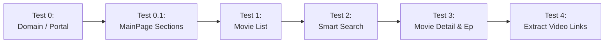

# 🏛️ TÀI LIỆU KIẾN TRÚC MẪU CLOUDSTREAM PROVIDER (CHUẨN HYBRID PATTERN)
> **Nguồn tham chiếu thực tế:** `VieflixProvider` & `JavaRunTest`  
> **Mục đích:** Hướng dẫn toàn diện về mô hình kiến trúc, cấu trúc phân lớp, luồng dữ liệu và quy trình từng bước (step-by-step) để xây dựng một Movie Provider mới nhanh chóng, chuẩn hóa, dễ bảo trì và kiểm thử độc lập.

---

## 📑 MỤC LỤC
1. [Tại sao cần mô hình Hybrid (Java Pure Logic + Kotlin Adapter)?](#1-tại-sao-cần-mô-hình-hybrid)
2. [Sơ đồ tổng quan kiến trúc hệ thống](#2-sơ-đồ-tổng-quan-kiến-trúc-hệ-thống)
3. [Cấu trúc thư mục & Phân bổ trách nhiệm (Separation of Concerns)](#3-cấu-trúc-thư-mục--phân-bổ-trách-nhiệm)
4. [Chi tiết các tầng kiến trúc (Layer-by-Layer Detail)](#4-chi-tiết-các-tầng-kiến-trúc)
   - [4.1. Tầng Model lõi (`com.cloudstream.core.model`)](#41-tầng-model-lõi-comcloudstreamcoremodel)
   - [4.2. Tầng Abstraction & Tiện ích (`com.cloudstream.core.parser` & `util`)](#42-tầng-abstraction--tiện-ích)
   - [4.3. Tầng Triển khai nghiệp vụ (`com.[provider]`)](#43-tầng-triển-khai-nghiệp-vụ)
   - [4.4. Tầng Kiểm thử độc lập (`JavaRunTest/src/test`)](#44-tầng-kiểm-thử-độc-lập)
   - [4.5. Tầng Cầu nối CloudStream (`[Provider]Provider.kt`)](#45-tầng-cầu-nối-cloudstream)
5. [Các kỹ thuật bóc tách dữ liệu nâng cao (Advanced Scraping Patterns)](#5-các-kỹ-thuật-bóc-tách-dữ-liệu-nâng-cao)
6. [Quy trình 8 bước phát triển một Provider mới (Checklist & Workflow)](#6-quy-trình-8-bước-phát-triển-một-provider-mới)
7. [Mẫu khung chuẩn (Boilerplate Code Template)](#7-mẫu-khung-chuẩn-boilerplate-code-template)

---

## 1. Tại sao cần mô hình Hybrid?

### ⚠️ Khó khăn khi viết Provider theo cách truyền thống (Pure Kotlin trong Android):
1. **Build chậm**: Mỗi lần thay đổi 1 dòng code bóc tách (selector, regex), bạn phải chạy Gradle build ra file `.cs3`, dexing, đẩy vào máy ảo hoặc thiết bị Android qua ADB rồi mở app test. Quá trình này mất từ 30s đến 2 phút cho mỗi lần debug.
2. **Khó viết Unit Test**: Môi trường Android plugin phụ thuộc vào các stub CloudStream (`app.get()`, `newMovieSearchResponse()`), khó chạy JUnit thuần trên máy tính nếu không mock phức tạp.
3. **Dễ gãy khi web đổi giao diện**: Khi trang phim thay đổi HTML, việc bảo trì trong code Kotlin trộn lẫn giữa network call, parse DOM và mapping UI gây rối rắm.

### 💡 Giải pháp Kiến trúc Hybrid (Pure Java Core + Kotlin Bridge):
- **Tách biệt hoàn toàn logic cào dữ liệu**: Toàn bộ việc parse HTML, JSON, Regex, bóc tách link được viết bằng **Java 8 thuần** (`Jsoup`, `org.json`, `Regex`) trong module **`JavaRunTest`**.
- **Kiểm thử siêu tốc (Instant TDD)**: Chạy JUnit test trực tiếp trên IDE (IntelliJ, VSCode) hoặc bằng Maven (`mvn test`) chỉ mất **0.5 - 2 giây**. Có thể test cả mock HTML lẫn live network.
- **Provider Kotlin siêu mỏng (Thin Adapter)**: Provider Kotlin chỉ làm đúng 3 việc:
  1. Khai báo Metadata của CloudStream (`name`, `mainUrl`, `supportedTypes`).
  2. Gửi request HTTP lấy HTML (`app.get()`).
  3. Gọi static method sang Java Logic và convert sang Model của CloudStream.
- **Tự động đồng bộ khi Build**: Gradle task `syncJavaFromTest` tự động copy mã nguồn Java sang module Provider trước khi compile thành file `.cs3`.

---

## 2. Sơ đồ tổng quan kiến trúc hệ thống

```mermaid
flowchart TB
    subgraph "MÔI TRƯỜNG PHÁT TRIỂN & TEST (JavaRunTest)"
        A[HTML / JSON từ Website Phim] --> B[com.cloudstream.core.util\nHtmlHelper, RegexHelper]
        B --> C[com.[provider].[Provider]Parser\nTriển khai MovieParser Interface]
        C --> D[com.[provider].[Provider]Logic\nStatic Facade & Data Model]
        D --> E[JUnit 5 Test Suite\n[Provider]LogicTest\n(Chạy trong < 1s)]
    end

    subgraph "TỰ ĐỘNG ĐỒNG BỘ (Gradle Build)"
        D -. "Task: syncJavaFromTest\n(Copy Java sources)" .-> F[Module [Provider]Provider\nsrc/main/java]
    end

    subgraph "MÔI TRƯỜNG RUNTIME (CloudStream App Android)"
        G[Người dùng thao tác trên App] --> H[[Provider]Provider.kt\n(Kế thừa MainAPI)]
        H -->|1. app.get url| I[Mạng Internet]
        I -->|2. Trả về HTML| H
        H -->|3. Delegate parse| F
        F -->|4. Trả về Java Models| H
        H -->|5. Map sang CloudStream Types| J[Giao diện CloudStream\n(Home, Search, Detail, Player)]
    end
```

---

## 3. Cấu trúc thư mục & Phân bổ trách nhiệm

```text
cloudstreamPlugin/
├── JavaRunTest/                           # [MODULE 1: Pure Java Logic & Test]
│   ├── pom.xml                            # Quản lý bằng Maven (Jsoup, org.json, JUnit 5)
│   └── src/
│       ├── main/java/
│       │   └── com/
│       │       ├── cloudstream/core/      # CORE CHUNG CHO TẤT CẢ PROVIDER
│       │       │   ├── model/             # POJO Models chuẩn (MovieItem, MovieDetail, VideoLink, ...)
│       │       │   ├── parser/            # MovieParser Interface
│       │       │   └── util/              # HtmlHelper, RegexHelper
│       │       └── [provider]/            # CODE RIÊNG CỦA TỪNG NGUỒN (Vd: vieflix, ophim, ...)
│       │           ├── [Provider]Parser.java  # Triển khai bóc tách chi tiết (DOM, JSON, Regex)
│       │           └── [Provider]Logic.java   # Facade tĩnh cung cấp API cho Kotlin & Test
│       └── test/java/com/[provider]/
│           └── [Provider]LogicTest.java   # Test suite bao phủ toàn bộ luồng cào dữ liệu
│
├── [Provider]Provider/                    # [MODULE 2: CloudStream Android Plugin]
│   ├── build.gradle.kts                   # Metadata plugin + Task syncJavaFromTest
│   └── src/main/
│       ├── java/                          # (Được tự động copy từ JavaRunTest khi build)
│       └── kotlin/com/[provider]/
│           ├── [Provider]Plugin.kt        # Entrypoint (@CloudstreamPlugin)
│           └── [Provider]Provider.kt      # MainAPI Adapter kết nối Cloudstream
│
├── build.gradle.kts                       # Cấu hình Gradle chung
└── settings.gradle.kts                    # Tự động include các Provider subproject
```

---

## 4. Chi tiết các tầng kiến trúc

### 4.1. Tầng Model lõi (`com.cloudstream.core.model`)
Các model là Java POJO độc lập với framework, chỉ chứa dữ liệu thuần túy:

| Model | Mục đích | Các trường dữ liệu chính |
| :--- | :--- | :--- |
| `MovieItem` | Thẻ phim trong danh sách | `title`, `href`, `posterUrl`, `tags` (danh sách badge như LT, TM, VS, HD) |
| `MovieDetail` | Chi tiết một bộ phim | `title`, `posterUrl`, `plot`, `year`, `duration`, `tags`, `episodes` (List<EpisodeItem>) |
| `EpisodeItem` | Một tập phim | `href`, `name`, `episodeNum` |
| `VideoLink` | Link phát video trực tiếp | `type` (M3U8/EMBED), `url`, `label`, `serverName`, `langName` |
| `MainPageSection` | Danh mục/Mục trên trang chủ | `name` (Tên hiển thị), `path` (Đường dẫn tương đối hoặc tuyệt đối) |

---

### 4.2. Tầng Abstraction & Tiện ích

#### `MovieParser.java` (Interface chuẩn):
Tất cả các nguồn phim mới **bắt buộc** triển khai interface này:
```java
public interface MovieParser {
    // 1. Parse danh mục trang chủ (tùy chọn)
    default List<MainPageSection> parseMainPage(String content, String baseUrl) {
        return Collections.emptyList();
    }

    // 2. Parse danh sách phim (Trang chủ / Tìm kiếm / Thể loại)
    List<MovieItem> parseMovieList(String content, String baseUrl);

    // 3. Parse chi tiết phim và danh sách tập
    MovieDetail parseMovieDetail(String content, String baseUrl);

    // 4. Trích xuất link stream (M3U8 / Embed)
    List<VideoLink> extractVideoLinks(String content, String slugOrData);
}
```

#### `HtmlHelper.java` & `RegexHelper.java`:
- `HtmlHelper.getAbsoluteUrl(baseUrl, element, "href")`: Tự động xử lý link tương đối `/phim/abc` -> `https://domain.com/phim/abc`.
- `HtmlHelper.textOrEmpty(element)`: Lấy text an toàn chống `NullPointerException`.
- `RegexHelper.parseInt(input, regex)`: Bóc tách số nguyên (năm, tập, thời lượng).
- `RegexHelper.extractBetween(text, start, end)`: Bóc tách nhanh chuỗi giữa 2 đoạn text (rất hữu hiệu khi trích xuất JSON trong `<script>`).

---

### 4.3. Tầng Triển khai nghiệp vụ (`com.[provider]`)

Tầng này gồm 2 class cho mỗi provider:
1. **`[Provider]Parser.java`**:
   - Chứa toàn bộ thuật toán cào DOM bằng `Jsoup`, xử lý chuỗi JSON và Regex.
   - Triển khai Singleton Pattern (`getInstance()`).
   - Có thể chứa các hàm chuyên biệt như `parseDomain()` (tên miền động), `buildSearchUrl()` (tìm kiếm thông minh).
2. **`[Provider]Logic.java`**:
   - Đóng vai trò **Static Facade**.
   - Chứa Type Aliases kế thừa từ Model core (giúp tương thích ngược).
   - Cung cấp các hàm tĩnh `[Provider]Logic.parseMovieList(...)` để code Kotlin chỉ cần gọi 1 dòng ngắn gọn.

---

### 4.4. Tầng Kiểm thử độc lập (`JavaRunTest/src/test`)

Tệp `[Provider]LogicTest.java` tổ chức 5 test case chuẩn theo đúng vòng đời người dùng xem phim:



Mỗi test case gồm 2 phần:
1. **Unit Test với Mock HTML/JSON**: Đảm bảo thuật toán Regex / DOM Selector đúng trên dữ liệu mẫu cứng.
2. **Integration Test với Live Network (Jsoup.connect)**: Kiểm tra trực tiếp với server web thật để phát hiện ngay khi web mục tiêu thay đổi cấu trúc.

---

### 4.5. Tầng Cầu nối CloudStream (`[Provider]Provider.kt`)

Kotlin Provider kế thừa `MainAPI()` và chỉ làm nhiệm vụ Mapping kiểu dữ liệu:

```kotlin
class VieflixProvider : MainAPI() {
    override var mainUrl = VieflixLogic.DEFAULT_BASE_URL
    override var name = "Vieflix"
    override val supportedTypes = setOf(TvType.Movie, TvType.TvSeries, TvType.Anime)
    override var lang = "vi"
    override val hasMainPage = true

    // 1. Cấu hình Trang chủ
    override val mainPage: List<MainPageData> = mainPageOf(...)

    // 2. Tải danh sách phim trang chủ
    override suspend fun getMainPage(page: Int, request: MainPageRequest): HomePageResponse {
        val domain = getDomain()
        val url = buildUrl(domain, request.data, page)
        val html = app.get(url).text
        val items = VieflixLogic.parseMovieList(html, domain).mapNotNull { toSearchResponse(it) }
        return newHomePageResponse(request, items, hasNext = items.size >= 24)
    }

    // 3. Tìm kiếm
    override suspend fun search(query: String, page: Int): SearchResponseList {
        val domain = getDomain()
        val searchUrl = VieflixLogic.buildSearchUrl(domain, query, page)
        val html = app.get(searchUrl).text
        val items = VieflixLogic.parseMovieList(html, domain).mapNotNull { toSearchResponse(it) }
        return newSearchResponseList(items, hasNext = items.size >= 24)
    }

    // 4. Chi tiết phim
    override suspend fun load(url: String): LoadResponse {
        val html = app.get(url).text
        val detail = VieflixLogic.parseMovieDetail(html, mainUrl)
        val episodesList = detail.episodes.map { ep ->
            newEpisode(ep.href) { this.name = ep.name; this.episode = ep.episodeNum }
        }
        return if (episodesList.size > 1) {
            newTvSeriesLoadResponse(detail.title, url, TvType.TvSeries, episodesList) { ... }
        } else {
            newMovieLoadResponse(detail.title, url, TvType.Movie, episodesList.firstOrNull()?.data ?: url) { ... }
        }
    }

    // 5. Trích xuất link phát
    override suspend fun loadLinks(data: String, isCasting: Boolean, subtitleCallback: (SubtitleFile) -> Unit, callback: (ExtractorLink) -> Unit): Boolean {
        val html = app.get(data).text
        val links = VieflixLogic.extractVideoLinks(html, slug)
        for (link in links) {
            if (link.type == VideoLink.TYPE_M3U8) {
                callback.invoke(ExtractorLink(link.serverName, link.langName, link.url, referer, Qualities.P1080.value, ExtractorLinkType.M3U8))
            } else if (link.type == VideoLink.TYPE_EMBED) {
                loadExtractor(link.url, referer, subtitleCallback) { callback.invoke(it) }
            }
        }
        return true
    }
}
```

---

## 5. Các kỹ thuật bóc tách dữ liệu nâng cao

### 5.1. Tự động phân giải tên miền động (Dynamic Domain Resolver)
- **Vấn đề**: Các trang web xem phim thường xuyên bị chặn mạng và phải đổi đuôi tên miền (`.top`, `.is`, `.to`, `.tv`).
- **Giải pháp**:
  - Truy vấn vào trang Portal ổn định (vd: `vieflix.com` hoặc file JS cấu hình `constan.js`).
  - Dùng Regex / Jsoup bóc tách domain đích thực tế.
  - Lưu vào biến tĩnh `cachedDomain` để không phải request lại nhiều lần.

### 5.2. Công cụ tìm kiếm thông minh bằng Tag/Hashtag (Smart Filter Search)
- **Cơ chế**: Cho phép người dùng gõ từ khóa kèm tag trong thanh tìm kiếm CloudStream (vd: `conan #thuyetminh nam:2024 #chieurap`).
- **Xử lý**:
  - `buildSearchUrl()` nhận query thô.
  - Quét qua danh sách regex nhận diện: Thể loại (`#kinhdi`), Quốc gia (`#hanquoc`), Loại phim (`#phimbo`), Ngôn ngữ (`#thuyetminh`), Năm (`nam:2024`).
  - Ghép các tham số URL (`?category=...&country=...&lang=...&year=...`).
  - Xóa các tag đã xử lý và giữ lại từ khóa tìm kiếm chính gửi vào tham số `search=...`.

### 5.3. Bóc tách JSON đa máy chủ (Multi-Server / Multi-Language Unpacker)
- Nếu dữ liệu video nằm trong thẻ `<script>` dưới dạng JSON lồng nhau:
  - Dùng thuật toán đếm ngoặc `[` `]` hoặc `{` `}` để trích xuất chính xác khối JSON mà không bị lỗi khi JSON chứa các ký tự đặc biệt.
  - Duyệt qua mảng `sources` -> danh sách `server` -> `languages` (`Vietsub`, `Thuyết minh`, `Lồng tiếng`, `Song ngữ`) -> `episodes`.
  - Luôn bổ sung cơ chế **Fallback Regex** nếu cấu trúc JSON chính thay đổi.

### 5.4. Gắn Badges ngôn ngữ & DubStatus lên giao diện
- Trích xuất nhãn từ thẻ HTML (`LT`, `VS`, `TM`, `SN`).
- Gán `dubStatus = EnumSet.of(DubStatus.Dubbed, DubStatus.Subbed)` để hiển thị icon SUB/DUB trực tiếp trên góc poster phim của app CloudStream.
- Đặt `otherName = "🎙️ Lồng Tiếng • 🔤 Vietsub"` để hiển thị rõ phụ đề dưới tên phim khi người dùng lướt trên Android TV.

---

## 6. Quy trình 8 bước phát triển một Provider mới

Khi bạn muốn thêm một nguồn phim mới (ví dụ: `OphimProvider`, `MotchillProvider`):

```text
[BƯỚC 1] Tạo package trong JavaRunTest
         └── src/main/java/com/[provider]/

[BƯỚC 2] Tạo file Test tương ứng
         └── src/test/java/com/[provider]/[Provider]LogicTest.java

[BƯỚC 3] Bóc tách & hoàn thiện [Provider]Parser.java
         ├── 1. parseMovieList (Trang chủ / Danh mục)
         ├── 2. parseMovieDetail & parseEpisodes
         └── 3. extractVideoLinks (M3U8 / Embed)

[BƯỚC 4] Chạy Unit Test kiểm tra tính đúng đắn
         └── Lệnh: mvn test -Dtest=[Provider]LogicTest

[BƯỚC 5] Tạo module [Provider]Provider trong thư mục gốc
         ├── Copy build.gradle.kts từ VieflixProvider
         └── Đổi tên metadata (name, description, tvTypes)

[BƯỚC 6] Tạo [Provider]Plugin.kt và [Provider]Provider.kt
         └── Kế thừa MainAPI và map kết quả từ [Provider]Logic

[BƯỚC 7] Build file plugin .cs3
         └── Lệnh: .\gradlew.bat [Provider]Provider:make

[BƯỚC 8] Cài đặt và kiểm tra thực tế trên ứng dụng CloudStream
```

---

## 7. Mẫu khung chuẩn (Boilerplate Code Template)

Dưới đây là mã nguồn khung chuẩn, bạn có thể copy và đổi tên `Template` thành tên Provider mới:

### 📄 1. `TemplateParser.java`
```java
package com.template;

import com.cloudstream.core.model.EpisodeItem;
import com.cloudstream.core.model.MainPageSection;
import com.cloudstream.core.model.MovieDetail;
import com.cloudstream.core.model.MovieItem;
import com.cloudstream.core.model.VideoLink;
import com.cloudstream.core.parser.MovieParser;
import com.cloudstream.core.util.HtmlHelper;
import com.cloudstream.core.util.RegexHelper;
import org.jsoup.Jsoup;
import org.jsoup.nodes.Document;
import org.jsoup.nodes.Element;
import org.jsoup.select.Elements;

import java.util.ArrayList;
import java.util.Collections;
import java.util.List;

public class TemplateParser implements MovieParser {

    public static final String DEFAULT_BASE_URL = "https://example.com";
    private static final TemplateParser INSTANCE = new TemplateParser();

    public static TemplateParser getInstance() {
        return INSTANCE;
    }

    @Override
    public List<MovieItem> parseMovieList(String html, String baseUrl) {
        List<MovieItem> list = new ArrayList<>();
        if (html == null || html.isEmpty()) return list;

        Document doc = Jsoup.parse(html, baseUrl);
        Elements items = doc.select(".movie-card, .film-item"); // Thay selector tương ứng

        for (Element el : items) {
            Element link = el.selectFirst("a");
            if (link == null) continue;

            String href = HtmlHelper.getAbsoluteUrl(baseUrl, link, "href");
            String title = HtmlHelper.selectFirstText(el, ".title, h3, h2");
            Element img = el.selectFirst("img");
            String poster = (img != null) ? img.attr("src") : null;

            list.add(new MovieItem(title, href, poster, Collections.emptyList()));
        }
        return list;
    }

    @Override
    public MovieDetail parseMovieDetail(String html, String baseUrl) {
        Document doc = Jsoup.parse(html, baseUrl);

        String title = HtmlHelper.selectFirstText(doc, "h1.title, .movie-title");
        String poster = doc.selectFirst("img.poster, .movie-thumb img") != null 
                ? doc.selectFirst("img.poster, .movie-thumb img").attr("src") : null;
        String plot = HtmlHelper.selectFirstText(doc, ".description, .plot, #synopsis");

        Integer year = RegexHelper.parseInt(html, "\\b(19\\d{2}|20\\d{2})\\b");
        Integer duration = RegexHelper.parseInt(html, "([0-9]+)\\s*(?:phút|mins)");

        List<EpisodeItem> episodes = new ArrayList<>();
        Elements epLinks = doc.select("a.episode-item, .list-server a");
        int count = 1;
        for (Element ep : epLinks) {
            String href = HtmlHelper.getAbsoluteUrl(baseUrl, ep, "href");
            String name = ep.text().trim();
            if (name.isEmpty()) name = "Tập " + count;
            episodes.add(new EpisodeItem(href, name, count++));
        }

        return new MovieDetail(title, poster, plot, year, duration, Collections.emptyList(), episodes);
    }

    @Override
    public List<VideoLink> extractVideoLinks(String html, String slugOrData) {
        List<VideoLink> links = new ArrayList<>();
        // Trích xuất M3U8 hoặc Embed iframe từ HTML
        String m3u8 = RegexHelper.extractGroup(html, "(https?://[^\"']+\\.m3u8[^\"']*)", 1);
        if (m3u8 != null) {
            links.add(new VideoLink(VideoLink.TYPE_M3U8, m3u8, "M3U8 Fast", "Server 1", "Vietsub"));
        }

        String iframe = RegexHelper.extractGroup(html, "<iframe[^>]+src=[\"']([^\"']+)[\"']", 1);
        if (iframe != null) {
            links.add(new VideoLink(VideoLink.TYPE_EMBED, iframe, "Embed Server", "Server 2", "Vietsub"));
        }
        return links;
    }

    public String buildSearchUrl(String baseUrl, String query, int page) {
        return baseUrl + "/search?q=" + query + "&page=" + page;
    }
}
```

---

### 📄 2. `TemplateLogic.java`
```java
package com.template;

import com.cloudstream.core.model.MovieDetail;
import com.cloudstream.core.model.MovieItem;
import com.cloudstream.core.model.VideoLink;

import java.util.List;

public class TemplateLogic {
    public static final String DEFAULT_BASE_URL = TemplateParser.DEFAULT_BASE_URL;

    public static List<MovieItem> parseMovieList(String html, String baseUrl) {
        return TemplateParser.getInstance().parseMovieList(html, baseUrl);
    }

    public static MovieDetail parseMovieDetail(String html, String baseUrl) {
        return TemplateParser.getInstance().parseMovieDetail(html, baseUrl);
    }

    public static List<VideoLink> extractVideoLinks(String html, String slug) {
        return TemplateParser.getInstance().extractVideoLinks(html, slug);
    }

    public static String buildSearchUrl(String baseUrl, String query, int page) {
        return TemplateParser.getInstance().buildSearchUrl(baseUrl, query, page);
    }
}
```

---

### 📄 3. `TemplateProvider/build.gradle.kts`
```kotlin
import java.text.SimpleDateFormat
import java.util.Date
import java.util.TimeZone

fun getGitHash(): String {
    return try {
        val p = ProcessBuilder("git", "rev-parse", "--short", "HEAD").redirectErrorStream(true).start()
        p.waitFor()
        p.inputStream.bufferedReader().readText().trim()
    } catch (e: Exception) {
        "unknown"
    }
}

version = 1

cloudstream {
    description = "Nguồn xem phim Template mẫu (Build: ${getGitHash()})"
    authors = listOf("HuyTV")
    status = 1
    tvTypes = listOf("Movie", "TvSeries")
    requiresResources = false
    language = "vi"
    iconUrl = "https://example.com/icon.png"
}

// Tự động đồng bộ mã nguồn Java từ module JavaRunTest sang Provider trước khi biên dịch
tasks.register<Copy>("syncJavaFromTest") {
    val sourceDir = file("${rootProject.projectDir}/JavaRunTest/src/main/java")
    if (sourceDir.exists()) {
        from(sourceDir)
        into(file("src/main/java"))
    }
}

tasks.matching { it.name.startsWith("compile") || it.name == "preBuild" }.configureEach {
    dependsOn("syncJavaFromTest")
}
```

---

### 📄 4. `TemplateProvider.kt`
```kotlin
package com.template

import com.cloudstream.core.model.MovieItem
import com.lagradost.cloudstream3.*
import com.lagradost.cloudstream3.utils.ExtractorLink
import com.lagradost.cloudstream3.utils.ExtractorLinkType
import com.lagradost.cloudstream3.utils.Qualities
import com.lagradost.cloudstream3.utils.loadExtractor

class TemplateProvider : MainAPI() {
    override var mainUrl = TemplateLogic.DEFAULT_BASE_URL
    override var name = "Template"
    override val supportedTypes = setOf(TvType.Movie, TvType.TvSeries)
    override var lang = "vi"
    override val hasMainPage = true

    override val mainPage: List<MainPageData> = mainPageOf(
        "/phim-moi" to "Phim Mới Cập Nhật",
        "/phim-le" to "Phim Lẻ",
        "/phim-bo" to "Phim Bộ"
    )

    override suspend fun getMainPage(page: Int, request: MainPageRequest): HomePageResponse {
        val url = "$mainUrl${request.data}?page=$page"
        val html = app.get(url).text
        val items = TemplateLogic.parseMovieList(html, mainUrl).map { toSearchResponse(it) }
        return newHomePageResponse(request, items, hasNext = items.isNotEmpty())
    }

    override suspend fun search(query: String, page: Int): SearchResponseList {
        val searchUrl = TemplateLogic.buildSearchUrl(mainUrl, query, page)
        val html = app.get(searchUrl).text
        val items = TemplateLogic.parseMovieList(html, mainUrl).map { toSearchResponse(it) }
        return newSearchResponseList(items, hasNext = items.isNotEmpty())
    }

    override suspend fun search(query: String): List<SearchResponse> {
        return search(query, 1).items
    }

    override suspend fun load(url: String): LoadResponse {
        val html = app.get(url).text
        val detail = TemplateLogic.parseMovieDetail(html, mainUrl)

        val episodesList = detail.episodes.map { ep ->
            newEpisode(ep.href) {
                this.name = ep.name
                this.episode = ep.episodeNum
            }
        }

        return if (episodesList.size > 1) {
            newTvSeriesLoadResponse(detail.title, url, TvType.TvSeries, episodesList) {
                this.posterUrl = detail.posterUrl
                this.plot = detail.plot
                this.year = detail.year
                this.duration = detail.duration
            }
        } else {
            newMovieLoadResponse(detail.title, url, TvType.Movie, episodesList.firstOrNull()?.href ?: url) {
                this.posterUrl = detail.posterUrl
                this.plot = detail.plot
                this.year = detail.year
                this.duration = detail.duration
            }
        }
    }

    override suspend fun loadLinks(
        data: String,
        isCasting: Boolean,
        subtitleCallback: (SubtitleFile) -> Unit,
        callback: (ExtractorLink) -> Unit
    ): Boolean {
        val html = app.get(data).text
        val links = TemplateLogic.extractVideoLinks(html, data)

        for (link in links) {
            if (link.type == VideoLink.TYPE_M3U8) {
                callback.invoke(
                    ExtractorLink(
                        source = link.serverName,
                        name = link.label,
                        url = link.url,
                        referer = mainUrl,
                        quality = Qualities.P1080.value,
                        type = ExtractorLinkType.M3U8
                    )
                )
            } else if (link.type == VideoLink.TYPE_EMBED) {
                loadExtractor(link.url, mainUrl, subtitleCallback) { extractedLink ->
                    callback.invoke(extractedLink)
                }
            }
        }
        return true
    }

    private fun toSearchResponse(item: MovieItem): SearchResponse {
        return newMovieSearchResponse(item.title, item.href, TvType.Movie) {
            this.posterUrl = item.posterUrl
        }
    }
}
```

---

## 8. Bảng lệnh thao tác nhanh (Command Cheat Sheet)

| Mục đích | Lệnh thực thi (PowerShell) |
| :--- | :--- |
| **Chạy toàn bộ Unit Test (Java)** | `cd JavaRunTest; mvn test` |
| **Chạy riêng Test của 1 Provider** | `cd JavaRunTest; mvn test -Dtest=VieflixLogicTest` |
| **Build toàn bộ Plugin ra file `.cs3`** | `.\gradlew.bat make` |
| **Build riêng 1 Plugin cụ thể** | `.\gradlew.bat VieflixProvider:make` |
| **Cài trực tiếp Plugin vào điện thoại qua ADB** | `.\gradlew.bat VieflixProvider:deployWithAdb` |
| **Tạo `plugins.json` để chia sẻ qua link repo** | `.\gradlew.bat makePluginsJson` |

---
*Tài liệu được biên soạn dựa trên chuẩn thiết kế Clean Architecture & Modular Plugin System của Cloudstream 3.*
