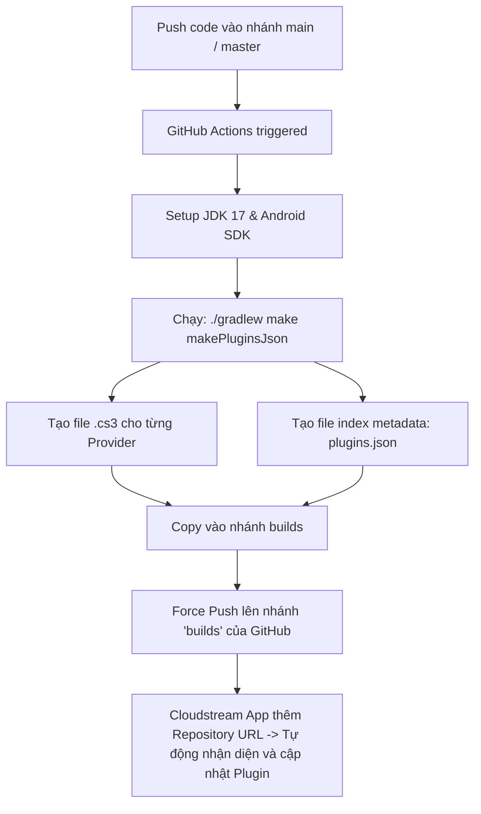

# 📖 TỔNG QUAN DỰ ÁN CLOUDSTREAM PLUGIN REPO

Repository này là **Cloudstream3 Plugin Repo Template** – một khung mẫu (template) chuẩn được tạo ra để phát triển, đóng gói và phân phối các **Plugin / Provider (nguồn phim, anime, tv shows, v.v.)** cho ứng dụng mã nguồn mở **Cloudstream 3** trên Android.

Kiến trúc plugin của Cloudstream được thiết kế lấy cảm hứng trực tiếp từ hệ thống plugin của [Aliucord](https://github.com/Aliucord), cho phép ứng dụng Android tải và thực thi động mã bytecode (được đóng gói dưới dạng file `.cs3`) mà không cần build lại toàn bộ ứng dụng chính.

---

## 🏗️ 1. Cấu trúc thư mục & Quản lý Dự án (Multi-project Build)

Dự án được quản lý bằng **Gradle (Kotlin DSL)** với cấu trúc modular:

```text
cloudstreamPlugin/
├── .github/workflows/
│   └── build.yml               # CI/CD pipeline tự động build plugin và tạo repository json
├── ExampleProvider/            # Subproject mẫu của 1 Plugin/Provider
│   ├── build.gradle.kts        # Cấu hình riêng & metadata cho ExampleProvider
│   └── src/main/
│       ├── AndroidManifest.xml
│       ├── kotlin/com/example/
│       │   ├── ExamplePlugin.kt    # Entrypoint đăng ký plugin vào Cloudstream
│       │   ├── ExampleProvider.kt  # Logic cào dữ liệu/trích xuất link phim (MainAPI)
│       │   └── BlankFragment.kt    # UI cấu hình plugin (Settings Dialog)
│       └── res/                    # Tài nguyên UI (layout, drawable, strings...)
├── build.gradle.kts            # Cấu hình Gradle chung cho tất cả các subproject/plugin
├── settings.gradle.kts         # Tự động scan và include các module plugin
└── gradle.properties           # Cấu hình bộ nhớ JVM & AndroidX
```

### Điểm đặc biệt trong cấu hình Gradle:
- [settings.gradle.kts](file:///d:/2.projects/fl/cloudstreamPlugin/cloudstreamPlugin/settings.gradle.kts): Có script tự động duyệt qua tất cả các thư mục con trong root. Nếu thư mục nào có `build.gradle.kts` và không nằm trong blacklist `disabled`, Gradle sẽ tự động `include(dir.name)` mà không cần bạn khai báo thủ công.
- [build.gradle.kts (root)](file:///d:/2.projects/fl/cloudstreamPlugin/cloudstreamPlugin/build.gradle.kts):
  - Áp dụng plugin `com.lagradost.cloudstream3.gradle` (Gradle plugin chính thức của Cloudstream).
  - Target Java 8 / JVM 1.8 và Android SDK 35 (`minSdk 21`).
  - Cung cấp sẵn các thư viện cốt lõi:
    - **`com.lagradost:cloudstream3:pre-release`**: Chứa các interface/stubs của Cloudstream core (`MainAPI`, `Plugin`, `TvType`, `Episode`, `ExtractorLink`...).
    - **`NiceHttp` (`com.github.Blatzar:NiceHttp`)**: Client HTTP tối ưu cho scraping, hỗ trợ xử lý cookies, session và custom headers.
    - **`Jsoup` (`org.jsoup:jsoup`)**: Trích xuất dữ liệu DOM HTML từ web.
    - **`Jackson Kotlin`**: Parser JSON (được ghim ở `2.13.1` để đảm bảo tương thích ngược trên Android đời cũ).

---

## 🧩 2. Kiến trúc & Vòng đời của một Plugin (`ExampleProvider`)

Một Plugin hoàn chỉnh bao gồm 2 thành phần chính:

### 2.1. Plugin Entrypoint ([ExamplePlugin.kt](file:///d:/2.projects/fl/cloudstreamPlugin/cloudstreamPlugin/ExampleProvider/src/main/kotlin/com/example/ExamplePlugin.kt))
- Được đánh dấu với `@CloudstreamPlugin` và kế thừa từ lớp `Plugin()`.
- Hàm `load(context: Context)` được gọi khi app Cloudstream load plugin:
  - Gọi `registerMainAPI(ExampleProvider())` để đưa Provider vào danh sách các nguồn xem phim của app.
  - Thiết lập lambda `openSettings`: Cho phép người dùng mở trang cài đặt riêng của plugin (như chọn domain, nhập tài khoản, chất lượng mặc định) thông qua `BottomSheetDialogFragment` ([BlankFragment.kt](file:///d:/2.projects/fl/cloudstreamPlugin/cloudstreamPlugin/ExampleProvider/src/main/kotlin/com/example/BlankFragment.kt)).

### 2.2. Provider Logic ([ExampleProvider.kt](file:///d:/2.projects/fl/cloudstreamPlugin/cloudstreamPlugin/ExampleProvider/src/main/kotlin/com/example/ExampleProvider.kt))
- Kế thừa từ `MainAPI()`. Đây là nơi triển khai toàn bộ logic nghiệp vụ khai thác trang web xem phim:
  - **Metadata**: `mainUrl`, `name`, `supportedTypes` (`setOf(TvType.Movie, TvType.TvSeries)`), `lang`, `hasMainPage`.
  - **Các phương thức quan trọng cần override khi viết một Provider thực tế**:
    1. `getMainPage(...)`: Lấy danh sách phim trên trang chủ theo từng section (Xu hướng, Phim mới, Phim bộ...).
    2. `search(query: String)`: Xử lý tìm kiếm phim theo từ khóa.
    3. `load(url: String)`: Lấy thông tin chi tiết một bộ phim (mô tả, diễn viên, danh sách tập/season...).
    4. `loadLinks(data: String, ...)`: Trích xuất stream URL (HLS `.m3u8`, file `.mp4`) hoặc gọi các extractor server (như Doodstream, Streamtape, v.v.).

### 2.3. Plugin Metadata ([ExampleProvider/build.gradle.kts](file:///d:/2.projects/fl/cloudstreamPlugin/cloudstreamPlugin/ExampleProvider/build.gradle.kts))
Khối `cloudstream { ... }` định nghĩa thông tin để hiển thị trong kho plugin của người dùng:
```kotlin
version = 1
cloudstream {
    description = "Mô tả plugin"
    authors = listOf("Tên tác giả")
    status = 1           // 0: Down, 1: Ok, 2: Slow, 3: Beta
    tvTypes = listOf("Movie")
    requiresResources = true
    language = "vi"      // hoặc "en"
    iconUrl = "https://..."
}
```

---

## 🚀 3. Luồng CI/CD & Phân phối Plugin

Quy trình tự động hóa được thiết lập tại [.github/workflows/build.yml](file:///d:/2.projects/fl/cloudstreamPlugin/cloudstreamPlugin/.github/workflows/build.yml):



---

## 🛠️ 4. Quy trình Phát triển & Debug

| Thao tác | Lệnh Windows (PowerShell/CMD) | Lệnh Linux/WSL/macOS |
| :--- | :--- | :--- |
| **Build toàn bộ plugin** | `.\gradlew.bat make` | `./gradlew make` |
| **Build 1 plugin cụ thể** | `.\gradlew.bat ExampleProvider:make` | `./gradlew ExampleProvider:make` |
| **Deploy trực tiếp vào máy Android (qua ADB)** | `.\gradlew.bat ExampleProvider:deployWithAdb` | `./gradlew ExampleProvider:deployWithAdb` |
| **Tạo `plugins.json`** | `.\gradlew.bat makePluginsJson` | `./gradlew makePluginsJson` |

> [!TIP]
> **Lưu ý khi test trên Android 11+:** Ứng dụng Cloudstream cần quyền `MANAGE_EXTERNAL_STORAGE` (All Files Access) để có thể nạp file `.cs3` từ bộ nhớ máy khi debug cục bộ.
